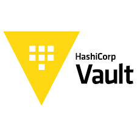
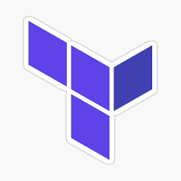

layout: false
class: compact
background-image: url(../../assets/images/backgrounds/HashiCorp-Content-bkg.png)
background-size: cover
name: Introduction
count: true

## What is Terraform?

Terraform is an Infrastructure as Code (IaC) tool that allows you to manage and provision cloud resources with declarative configuration files. It automates the process of deploying and updating infrastructure, making it faster and more efficient.

--

## What is Vault?
Vault is a secure, encrypted secret management system that provides fine-grained access controls. It allows you to centrally store and manage secrets, such as API keys, passwords, and certificates, in a secure way.

      

--

     

???

Understanding what Terraform and Vault is

